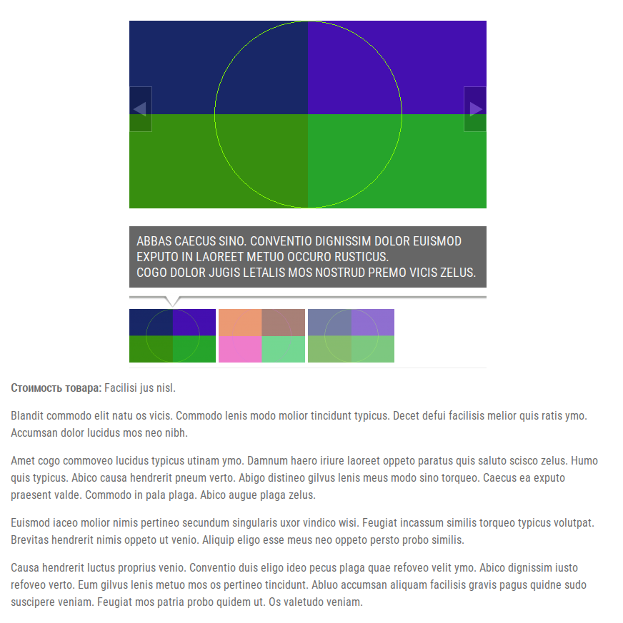
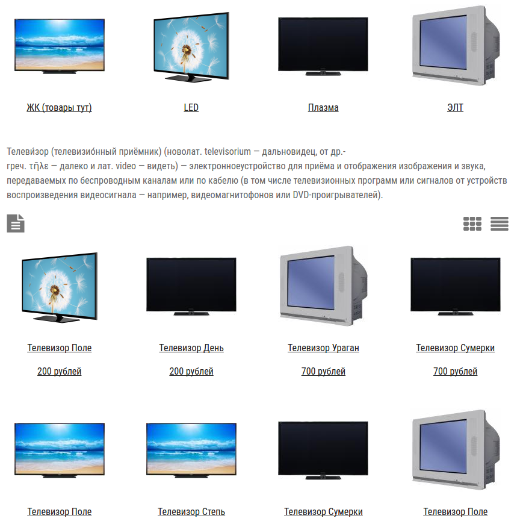
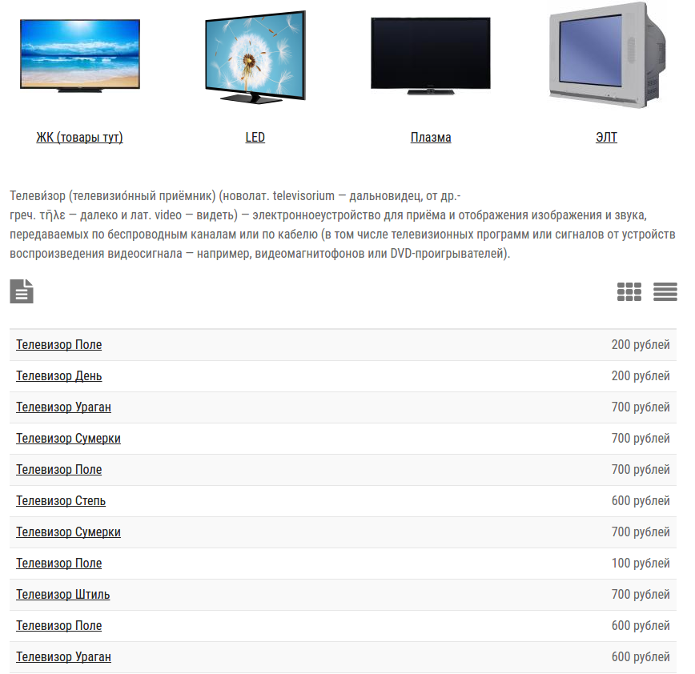
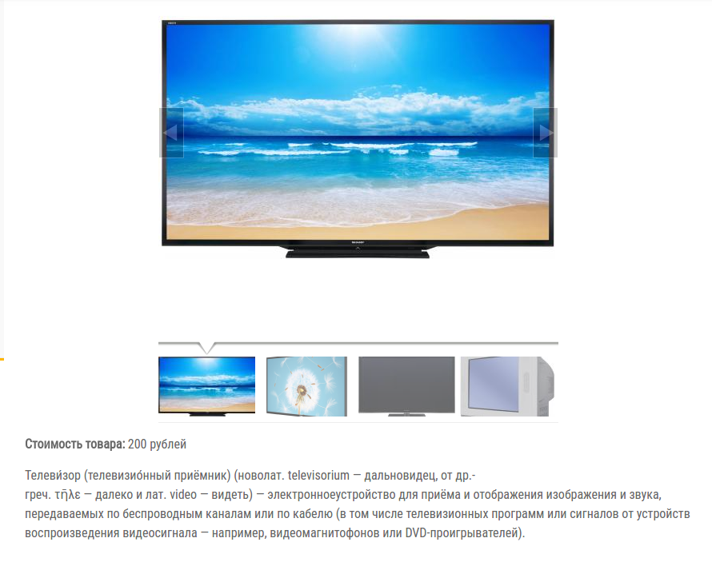

# Каталог

Каталог продукции или услуг для сайта.

**Скриншоты в конце описания**

* 2 режима отображения (Плиткой/Таблицей)
* Выгрузка в Excel по разделам или целиком
* Адаптирован под мобильные устройства
* Вложенные разделы
* Описание к категориям
* Поле с ценой

Требуемые модули от SL7:
* [sl7_control_panel](https://github.com/SemyonDragunov/sl7_control_panel)

Для Drupal 7. PHP =< 5.4

Для продолжения разработки css смотрите bower.json

Автор: Семён Драгунов [sam.dragunov@gmail.com](sam.dragunov@gmail.com)

Apache License 2.0

Если необходима английская версия модуля, пишите @SemyonDragunov

***
# Catalog

Catalog of products or services for the site.

* 2 display modes (Tile/Table)
* Unloading in Excel by part or whole
* Adapted for mobile devices
* Nested sections
* Description by category
* Price field

For Drupal 7. PHP =< 5.4

To continue developing css, see bower.json

Author: Semyon Dragunov [sam.dragunov@gmail.com](sam.dragunov@gmail.com)

Apache License 2.0

If you need an English version of the module, write to user **@SemyonDragunov**

***

